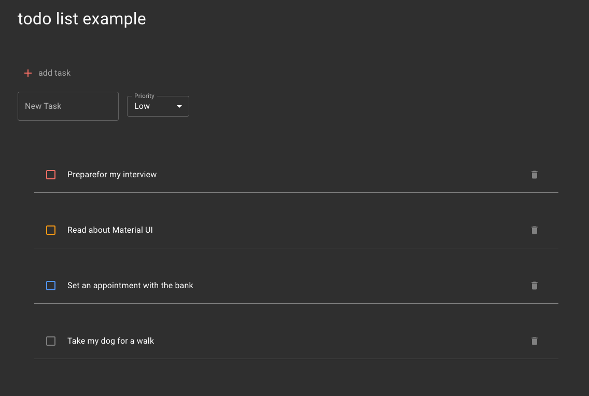

# To-Do List Application

This is a To-Do List application built using React and Material UI. It allows users to add, edit, mark as complete, and delete tasks. The application supports task priority and completion tracking. Testing is done using Jest and React Testing Library.

## Features

- Add new tasks with a name and priority level.
- Toggle task completion using a checkbox.
- Edit task names directly within the list.
- Delete tasks from the list.
- Uses Material UI for styling and UI components.

## Technologies Used

- **React**: Frontend framework.
- **Material UI (MUI)**: Styling and component library.
- **Jest**: JavaScript testing framework.
- **React Testing Library**: Library for testing React components.
- **TypeScript**: Typed JavaScript for building reliable applications.

### Installation

1. Clone the repository:

   ```bash
   git clone https://github.com/elenagurchinskaia/fe-home-challenge
   cd your-project-directory
   ```

### App


